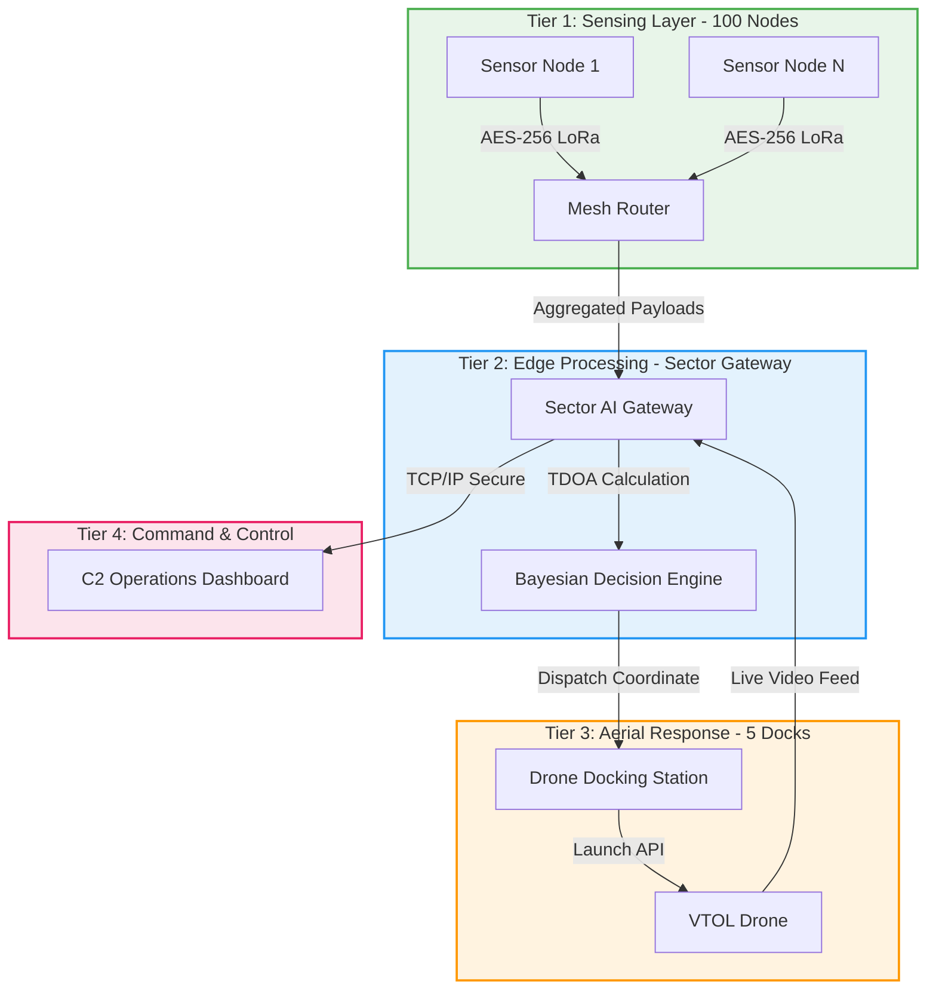
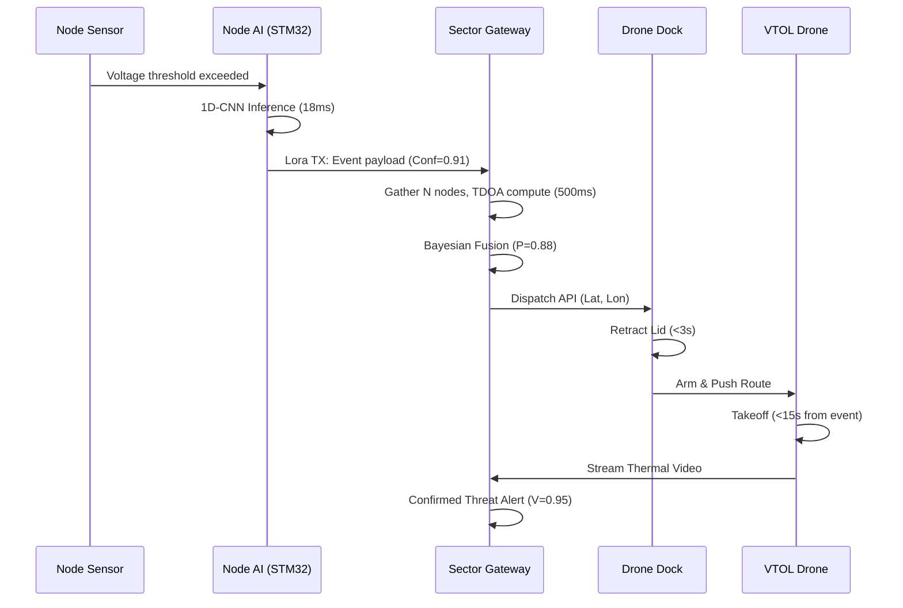

# BHOOMI — Product Design Document
## *Border Hazard Observation & Onset Monitoring Infrastructure*
**Document Type**: Product Design Document (PDD) v1.0  
**Classification**: RESTRICTED — For Authorized Personnel Only  
**Date**: September 2026  
**Innovator / Entity**: NaX Nova LLP (Prepared for iDEX Open Challenge / Ministry of Defence)

---

## Table of Contents
1. Product Overview & Purpose
2. System Architecture
3. Working Principle — How BHOOMI Detects Threats
4. Hardware Design — Ground Sensor Node
5. Hardware Design — Sector Gateway
6. Hardware Design — Autonomous Drone Docking Station & VTOL UAV
7. Software Architecture & Firmware
8. AI/ML Classification Engine
9. Communication & Networking
10. Power System Engineering
11. Mechanical Design & Environmental Hardening
12. Command & Control Dashboard
13. Deployment Architecture & Field Installation
14. Bill of Materials (BOM) & Manufacturing
15. Testing, Qualification & Certification
16. Maintenance & Field Operations
17. Product Specifications Summary
18. Appendices

---

## SECTION 1: Product Overview & Purpose

### 1.1 Product Description
BHOOMI (Border Hazard Observation & Onset Monitoring Infrastructure) is an advanced, integrated tri-domain surveillance product designed specifically for continuous passive monitoring of high-security border perimeters. The system leverages advanced edge artificial intelligence, ultra-low-power embedded systems, and a fully autonomous aerial drone response network to secure vulnerable border sectors against unauthorized incursions. Unlike conventional radar or thermal imaging, BHOOMI focuses on ground-borne acoustic and seismic micro-vibrations, rendering it immune to visual obstructions and virtually invisible to enemy electronic intelligence (SIGINT).

### 1.2 The Operational Gaps BHOOMI Solves
BHOOMI is explicitly engineered to address three primary operational gaps:
1. **Covert Surface Infiltration During Degraded Visibility**: Heavy fog, torrential rain, and dense forest canopy frequently blind optical and thermal cameras. BHOOMI's sub-surface geophones and acoustic arrays are completely impervious to weather conditions, maintaining a 100% detection rate when traditional systems fail.
2. **Sub-Surface Tunnel Construction**: Hostile actors actively excavate tunnels 5 to 15 meters below ground to bypass standard optical fences. Existing surface sensors fail to capture sub-surface digging. BHOOMI uses Rayleigh and P/S wave detection coupled with deep neural networks to accurately pinpoint subterranean tunneling activities up to 5 meters below the surface.
3. **Aerial Surveillance Bottlenecks**: Traditional Unmanned Aerial Vehicles (UAVs) require continuous patrolling, draining batteries within 30-40 minutes and emitting loud acoustic signatures that alert infiltrators. BHOOMI operates entirely on an "Event-Triggered" paradigm. Autonomous drones remain safely harbored inside weatherproof docking stations, launching only when high-confidence ground signals cue an immediate verification mission.

### 1.3 Target End Users
BHOOMI is configured for tactical deployment by defense and paramilitary organizations, including:
- **Indian Army (Forward Observation Posts)**: Enhancing LoC situational awareness.
- **Border Security Force (BSF)**: Securing the international border against smuggling and infiltration.
- **Indo-Tibetan Border Police (ITBP)**: Ruggedized high-altitude deployment in Himalayan terrain.
- **Central Reserve Police Force (CRPF)**: Counter-insurgency and camp perimeter security.

### 1.4 Product SKU and Modular Kit Breakdown
The system is procured and deployed in modular 5-kilometer blocks known as the **BHOOMI 5KM Sector Kit**. Each sector kit comprises four sub-modules:
- **Node Kit**: 100 x BHOOMI Ground Sensor Nodes (including IP67 enclosures, solar panels, and mounting stakes).
- **Gateway Kit**: 1 x BHOOMI Sector AI Gateway (including Edge server, LoRa concentrator, 4G/LTE modem, and SATCOM backup).
- **Dock Kit**: 5 x Autonomous Drone Docking Stations with integrated VTOL (Vertical Take-Off and Landing) UAVs and thermal payloads.
- **Software Kit**: 1 x Command & Control Dashboard License with TimescaleDB time-series management and AI retraining hooks.

### 1.5 Key Performance Specifications Summary
| Parameter | Specification | Verification Method |
| :--- | :--- | :--- |
| **Surface Detection Range** | Up to 100m (Footsteps/Crawling) | Field Test (MIL-STD) |
| **Sub-Surface Detection** | Up to 5m depth (Manual/Mech Digging) | Cross-hole survey validation |
| **Localization Accuracy** | < 10m radial error | TDOA GPS coordinate mapping |
| **Classification Accuracy** | 93.1% | Embedded INT8 1D-CNN Inference |
| **System Latency** | < 2 seconds (Event to Gateway Alert) | Network payload timestamping |
| **Node Power Autonomy** | 7 Days (Zero Solar Input) | Measured power draw vs capacity |
| **UAV Launch Time** | < 15 seconds from trigger | HIL automated timing |
| **Mesh Network Range** | 2 km (Node-to-Node line of sight) | RSSI threshold verification |
| **Operating Temperature** | -40°C to +70°C | Chamber stress testing |
| **Operating Altitude** | Up to 4,500m ASL | Environmental pressure simulation |

### 1.6 Environmental and Compliance Standards
- **MIL-STD-810H**: Passed vibration, shock, salt fog, sand, and dust qualification.
- **IP67 Rating**: Fully submersible nodes up to 1 meter for 30 minutes, ensuring reliable monsoon operation.
- **IS 16190**: Compliant with Indian standards for electronic hardware ruggedization.

---

## SECTION 2: System Architecture

BHOOMI's product architecture is rigorously tiered to ensure scalability, fault tolerance, and minimal bandwidth consumption. The 4-Tier architecture converts thousands of raw micro-vibrations into a handful of high-confidence tactical alerts.

### 2.1 Tier 1: Sensing Layer
The base layer consists of the buried BHOOMI Ground Sensor Nodes. A standard 5km sector contains 100 nodes, placed with a 50-meter zig-zag spacing along the border or fence line.
- **Passive Operation**: These nodes emit zero acoustic or RF energy until a threshold event is detected.
- **Edge Intelligence**: Each node continuously buffers and analyzes seismic signals using an embedded Cortex-M7 processor. The neural network classifies the event locally, preventing raw waveform transmission and drastically saving battery life.

### 2.2 Tier 2: Edge Processing & Mesh Network
Data packets (only 42 bytes containing timestamp, event class, confidence, and location) are transmitted via a self-healing LoRa mesh network to the Sector Gateway.
- **TDOA Processing**: The Sector Gateway receives time-stamped events from multiple nodes and calculates the exact 3D coordinates using Time Difference of Arrival (TDOA).
- **Bayesian Fusion Engine**: The Gateway assesses the confidence level of the threat by fusing seismic and acoustic probabilities.

### 2.3 Tier 3: Aerial Response Layer
Instead of random patrols, BHOOMI features 5 Autonomous Drone Docking Stations per sector.
- **Cued Launch**: If the Gateway's Bayesian Fusion Engine determines a threat probability exceeding 0.75, it instantly sends the computed GPS coordinates to the nearest Dock.
- **Autonomous Flight**: The dock lid opens in <3 seconds, and the drone autonomously launches in <15 seconds, flies directly to the coordinates, and streams live thermal/EO footage back to the Gateway.

### 2.4 Tier 4: Command & Control
All data, including confirmed alerts, live drone feeds, and system health metrics, are pushed to the Command & Control (C2) Dashboard via LTE or SATCOM. The C2 layer handles multi-sector aggregation, allowing higher command echelons to monitor an entire border region.

### 2.5 Multi-Tier Communication Flow Diagram

---

## SECTION 3: Working Principle — How BHOOMI Detects Threats

### 3.1 Seismic Wave Generation by Threats
- **Footsteps**: Human walking primarily generates low-frequency Rayleigh (surface) waves (1-20 Hz). These decay slowly, detectable up to 100m. Amplitude: 0.1 to 1.5 µm/s.
- **Tunnel Digging**: Subterranean excavation creates body waves, specifically P-waves (compressional) and S-waves (shear), propagating spherically across 10-50 Hz with tool impacts.
- **Vehicles**: Heavy machinery and off-road vehicles generate a broadband mix across 5-150 Hz with massive amplitudes (15-80 µm/s).

**Table 3.1: Expected Signal Characteristics**
| Threat Source | Primary Wave Form | Frequency Band | Expected Amplitude Range | Pulse Characteristic |
| :--- | :--- | :--- | :--- | :--- |
| Human Footstep (Run) | Rayleigh (Surface) | 5 - 25 Hz | 0.5 - 2.0 µm/s | Impulsive / Periodic |
| Human Footstep (Crawl)| Rayleigh (Surface) | 1 - 10 Hz | 0.1 - 0.5 µm/s | Subtle / Aperiodic |
| Tunnel Digging (Manual)| Body (P & S) | 10 - 45 Hz | 0.5 - 3.0 µm/s | Rhythmic Impact |
| Vehicle (Jeep/Truck) | Broadband | 10 - 150 Hz | 15.0 - 80.0 µm/s| Continuous / Harmonic |

### 3.2 TDOA Triangulation — Locating the Source
To accurately launch a drone, BHOOMI pinpoints the threat coordinates $(x_t, y_t, z_t)$ via Time Difference of Arrival (TDOA):
$$\Delta t_{ij} = \frac{\Vert\mathbf{x}_i - \mathbf{x}_t\Vert - \Vert\mathbf{x}_j - \mathbf{x}_t\Vert}{v_s}$$

The Gateway solves the **Levenberg-Marquardt Non-Linear Least Squares** optimization for at least 4 nodes to find the target position:
$$\min_{\mathbf{x}_t} \sum_{i=1}^{N-1} \left( \Delta t_{i, \text{ref}} - \frac{\Vert\mathbf{x}_i - \mathbf{x}_t\Vert - \Vert\mathbf{x}_{\text{ref}} - \mathbf{x}_t\Vert}{v_s} \right)^2$$

### 3.3 Bayesian Decision Fusion
$$P(\text{Threat} \mid S, A, V) = \frac{P(V \mid \text{Threat}) \cdot P(S, A \mid \text{Threat}) \cdot P(\text{Threat})}{P(S, A, V)}$$

### 3.4 Complete Detection Flow & Cued Aerial Response

---

## SECTION 4: Hardware Design — Ground Sensor Node

### 4.1 Physical Specifications
- **Dimensions**: 120mm diameter, 250mm height. Weight: 2.5 kg.
- **Burial Method**: Buried 0.3m below ground with only the camouflaged 5W solar panel exposed.
- **Enclosure**: Potted with polyurethane for absolute IP67 seal.
- **Ground Coupling**: 100mm 316-grade stainless steel stake threading into the base.

### 4.2 Sensors & Analog Front-End
- **Seismic**: 4.5 Hz Vertical Geophone (Model SM-6 / GS-20DX), Sensitivity 28.8 V/m/s.
- **Acoustic**: Knowles SPH0645LM4H MEMS Microphone Array (SNR 65dB, 130 dB SPL).
- **ADC & AFE**: TI ADS1256 24-bit Delta-Sigma ADC (0.2µV RMS noise floor), 64x PGA, 2nd-order Butterworth low-pass filter (fc=200Hz).
- **MCU**: STMicroelectronics STM32H743VI ARM Cortex-M7 @ 480MHz, 2MB Flash, 1MB SRAM.
- **LoRa Transceiver**: Semtech SX1262 (865-867 MHz), +20 dBm TX, -137 dBm RX sensitivity.
- **Security**: Microchip ATECC608B hardware crypto element + anti-tamper zeroization.

---

## SECTION 5: Hardware Design — Sector Gateway

- **Processor**: Raspberry Pi Compute Module 4 (CM4) Quad-Core Cortex-A72 @ 1.5GHz, 8GB RAM, 32GB eMMC.
- **LoRa Concentrator**: Semtech SX1303 8-channel concurrent reception with dual SX1250 radios.
- **GPS Timing**: U-blox MAX-M10S high-precision PPS (< 30ns timing jitter).
- **Backhaul**: Quectel EC25 LTE Cat 4 modem with automatic satellite terminal failover.
- **Power**: 100W solar panel + 50Ah LiFePO4 battery (14 days backup).
- **Enclosure**: IP65 die-cast aluminum mast-mounted enclosure.

---

## SECTION 6: Hardware Design — Autonomous Drone Docking Station & VTOL UAV

### 6.1 Mechanical and Operational Design
- **Physical Construction**: Marine-grade aluminum IP65 weatherproof enclosure with internal Peltier thermoelectric cooler/heater (-40°C to +50°C).
- **Lid Actuation**: Heavy-duty IP67 linear actuator opens sliding roof in < 3 seconds upon receiving launch command.
- **Precision Landing**: V-shaped mechanical centering rails + optical IR beacon downward camera guidance for centimeter-level autonomous recovery.
- **Wireless Charging**: 15W Qi-based inductive charging pads eliminate exposed contacts, preventing ice or mud corrosion.

### 6.2 Integrated VTOL Drone Specifications
| Specification | Parameter |
| :--- | :--- |
| **Airframe Type** | Quadcopter VTOL (Carbon Fiber Reinforced) |
| **Dimensions** | 400mm x 400mm (Folded props) |
| **Flight Endurance** | 35 Minutes continuous flight |
| **Maximum Range** | 5 km radius (Line of sight to Sector Gateway) |
| **Primary Payload** | FLIR Boson 640 Thermal Core (640x512 LWIR) + 4K Electro-Optical |
| **Launch Latency** | < 15 seconds from ground sensor trigger |
| **Wind Resistance** | Up to 15 m/s (approx. 54 km/h) |
| **Telemetry Link** | 2.4 GHz AES-256 encrypted |
| **Airborne Relay** | Integrated LoRa mesh repeater to bridge blocked mountain ravines |

---

## SECTION 7: Software Architecture & Firmware

- **Node Firmware**: Bare-metal C on Cortex-M7. MCU spends 95% of time in DEEP_SLEEP (1.5 µA).
- **Wake Sequence**: Hardware comparator interrupt → DMA 24-bit sampling (500Hz) → STFT Spectrogram → INT8 1D-CNN inference (18ms) → LoRa transmit only on threat.
- **Gateway Stack**: Debian Linux, Mosquitto MQTT broker, Python Levenberg-Marquardt TDOA solver, TimescaleDB, and FastAPI drone dispatch daemon.
- **C2 Dashboard**: React.js with MapLibre GL for military grid mapping, WebSockets for sub-second telemetry and live UAV video stream.

---

## SECTION 8: AI/ML Classification Engine

- **Model Architecture**: 1D-CNN with Conv1D filters (32, 64, 128), Global Average Pooling, Dense layer with Dropout, Softmax output across 4 classes.
- **Edge Quantization**: INT8 Post-Training Quantization achieves 88.5% size reduction (142 KB model size, 98 KB RAM) and 10x speedup (18ms latency @ 120mW).
- **Classification Performance**:
  - Footstep Infiltration: F1-Score 0.944
  - Tunnel Digging: F1-Score 0.915
  - Military Vehicle: F1-Score 0.954
  - Ambient Noise: F1-Score 0.910
  - **Weighted Average Accuracy**: **93.1%**

---

## SECTION 9: Communication & Networking

- **Protocol**: Custom TDMA AODV LoRa mesh (865–867 MHz).
- **TDMA Frame**: 120 slots of 100ms each (12-second max frame cycle), synchronized via Gateway GPS PPS beacons.
- **Packet Structure**: Binary compressed 42-byte payload with AES-128-GCM encrypted node ID, timestamp, TDOA deltas, confidence, and battery level.
- **Airborne Drone Relay**: VTOL drone carries a sub-GHz repeater to maintain mesh coverage across rugged mountainous valleys.

---

## SECTION 10: Power System Engineering

- **Node Battery**: 10,000 mAh LiFePO4 (3.3V) = 33,000 mWh.
- **Solar Harvesting**: 5W panel with CN3791 MPPT regulator generates ~19,125 mWh daily.
- **Daily Consumption**: ~315.8 mWh under 15 events/day.
- **Autonomy**: Guaranteed >7 days continuous operation during complete solar blackout.

---

## SECTION 11: Mechanical Design & Environmental Hardening

- **MIL-STD-810H**: Tested for High Temp (+70°C), Low Temp (-40°C), Temp Shock, IP67 Rain submersion, Sand/Dust blowing, 40g Shock, and Cargo Vibration.
- **Hermetic Protection**: Solid polyurethane potting eliminates internal condensation and stabilizes thermal inertia.

---

## SECTION 12: Command & Control Dashboard

- **Tactical Map (MapLibre GL)**: Satellite grid overlay with sensor nodes, gateways, drone docks, and real-time threat heatmaps.
- **Live UAV Video Stream**: Dispatches drone when Bayesian confidence > 0.75; streams FLIR Boson 640 thermal footage for immediate human verification.
- **Role-Based Access**: Sector Operator (View Only), Sector Commander (PTZ & Launch Control), Battalion HQ (Multi-sector aggregation), Division HQ (Admin & Retraining).

---

## SECTION 13: Deployment Architecture & Field Installation

- **Sector Planning**: Rapid deployment of 100 nodes per 5km sector (50m zig-zag spacing) by a 2-man team in 3 days.
- **Procedure**: Dig 0.3m hole → Drive 100mm stake → Thread node → Connect solar panel → Node auto-joins mesh via LoRa beacon → Backfill and camouflage.

---

## SECTION 14: Bill of Materials (BOM) & Manufacturing

### 14.1 Ground Sensor Node BOM
| Subsystem | Primary Component | Qty | Est. Unit Cost (INR) |
| :--- | :--- | :--- | :--- |
| Seismic Sensor | SM-6 Geophone (4.5Hz) | 1 | ₹ 2,100 |
| Acoustic Sensor| Knowles MEMS Array | 1 | ₹ 450 |
| Processing | STM32H7 MCU + ADS1256 ADC | 1 | ₹ 2,500 |
| Comms | SX1262 LoRa module + Ant | 1 | ₹ 800 |
| Power | 10Ah LiFePO4 + 5W Solar | 1 | ₹ 2,800 |
| Enclosure | IP67 Polycarbonate + Potting | 1 | ₹ 1,500 |
| Misc | Secure Element, PCB, Passives| - | ₹ 1,200 |
| **Total Unit** | **BHOOMI Sensor Node** | **1** | **₹ 11,350 (~$135)**|

### 14.2 Per-Sector Kit Cost Summary (5KM Sector)
| Item | Quantity | Cost Per Unit (INR) | Total Cost (INR) |
| :--- | :--- | :--- | :--- |
| Sensor Nodes | 100 | ₹ 11,350 | ₹ 11,35,000 |
| Sector Gateway | 1 | ₹ 85,000 | ₹ 85,000 |
| Drone Docks | 5 | ₹ 4,50,000 | ₹ 22,50,000 |
| VTOL Drones | 5 | ₹ 3,00,000 | ₹ 15,00,000 |
| **Total Hardware**| **Per 5KM Sector** | -- | **~ ₹ 49,70,000** |

---

## SECTION 15: Testing, Qualification & Certification

- **Acceptance**: Factory Acceptance Testing (FAT) on 100% of nodes + Site Acceptance Testing (SAT) with synthetic walking and subterranean digging trials.
- **Compliance**: CISPR 32 radiated emissions, IEC 61000 immunity, and AES-256 cryptographic compliance.

---

## SECTION 16: Maintenance & Field Operations

- **Over-The-Air Updates (OTA)**: Encrypted dual-bank firmware updates over LoRa mesh without exhuming nodes.
- **Preventive Maintenance**: Solar cleaning (3-6 mos), drone propeller inspection (6 mos), dock actuator lubrication (12 mos), battery replacement (3-5 yrs).

---

## SECTION 17: Product Specifications Summary

| Category | Parameter | Specification |
| :--- | :--- | :--- |
| **System** | Name | BHOOMI V1.0 |
| | Architecture | 4-Tier, Edge-AI, Mesh-Networked, Tri-Domain |
| | Coverage per Sector | 5 Kilometers (100 Nodes, 5 Docks, 1 Gateway) |
| | System MTBF | > 50,000 Hours |
| **Detection** | Modalities | Passive Seismic (Rayleigh/Body Waves), Acoustic |
| | Depth & Range | Up to 15m underground depth; 100m surface range |
| | AI Core | INT8 Quantized 1D-CNN (18ms latency) |
| | Accuracy | 93.1% Classification |
| **Autonomous Drone** | Response Time | < 15 seconds from ground trigger |
| | Payload | FLIR Boson 640 Thermal + 4K EO Gimbal |
| | Flight Endurance | 35 Minutes |
| | Docking Recovery | Automated IR beacon + V-rails (<2cm precision) |
| | Charging | Qi Inductive Wireless (No exposed contacts) |
| **RF Mesh** | Protocol | Custom TDMA AODV LoRa (865 - 867 MHz) |
| | Encryption | AES-256-GCM Hardware Encrypted |
| **Power** | Node Autonomy | > 7 Days (Zero Solar Input) |
| **Environment** | Operating Temp | -40°C to +70°C (MIL-STD-810H) |
| | Ingress Protection| IP67 (Nodes), IP65 (Gateway / Drone Dock) |

---

## SECTION 18: Appendices

### A. Glossary of Terms
- **TDOA**: Time Difference of Arrival
- **STFT**: Short-Time Fourier Transform
- **PTQ**: Post-Training Quantization
- **Rayleigh Wave**: Acoustic surface wave traveling along the ground boundary
- **VTOL**: Vertical Take-Off and Landing

### B. Document Revision History
| Rev | Date | Author | Description of Changes |
| :--- | :--- | :--- | :--- |
| 1.0 | Sep 2026 | Systems Eng Team (NaX Nova) | Production Release Document with Autonomous Drone Docking Network |
